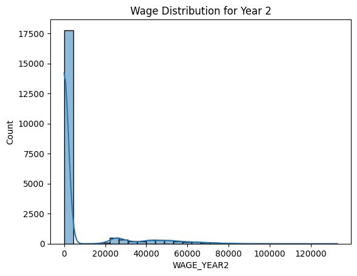
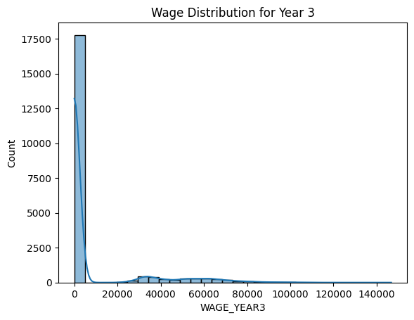
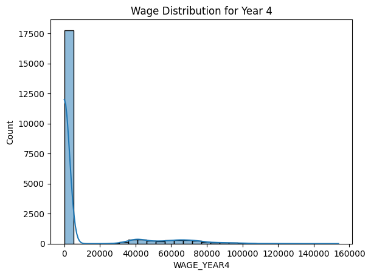
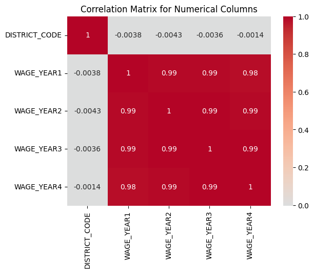

# x62-data-challenge-student-pathways

# Part 1: Data Exploration

Data quality: For each feature (column), what is the data type? Is there any missing data?
data type: 
    &nbsp;&nbsp;&nbsp;&nbsp;used df.dtypes in the ipynb file # Check data types of each column 
    &nbsp;&nbsp;&nbsp;&nbsp;In earnings_train.csv: 
    &nbsp;&nbsp;&nbsp;&nbsp;DISTRICT_TYPE, DISTRICT_NAME, ACADEMIC_YEAR, DEMO_CATEGORY, STUDENT_POPULATION, and AWARD_CATEGORY are classified as objects, while  
    &nbsp;&nbsp;&nbsp;&nbsp;DISTRICT_CODE, WAGE_YEAR1, WAGE_YEAR2, WAGE_YEAR3, and WAGE_YEAR4 are classified as floats. 
missing data: 
    &nbsp;&nbsp;&nbsp;&nbsp;used df.isna().sum() in the ipynb file # Check for missing data 
    &nbsp;&nbsp;&nbsp;&nbsp;All of the columns don't have missing data except for DISTRICT_CODE, which has 2745 missing data values out of the 20705 row values listed. 

Range: What are the unique values for each categorical column? What is the range of values of the numeric columns? Are the numeric column values normally distributed? 
unique values for each categorial column: 
    &nbsp;&nbsp;&nbsp;&nbsp;used df['col_name'].unique(); for each column, the unique values print all of the values listed in the data. 
    &nbsp;&nbsp;&nbsp;&nbsp;DISTRICT_TYPE: ['School District', 'Legislative District', 'All'] 
    &nbsp;&nbsp;&nbsp;&nbsp;DISTRICT_NAME: ['Duarte Unified', 'Coronado Unified', 'Gilroy Unified',
       'Pleasant Valley', 'Senate District 15', 'Adelanto Elementary',
       'Assembly District 56', 'Klamath-Trinity Joint Unified',
       'Modoc Joint Unified', 'Healdsburg Unified',
       'Kings County Office of Education', 'Assembly District 11',
       'Liberty Union High', 'Azusa Unified', 'Benicia Unified',
       'Konocti Unified', 'SBE - Vista Springs Charter',
       'Stone Corral Elementary', 'Santa Cruz County Office of Education',
       'Del Norte County Unified', 'Aromas - San Juan Unified',
       'Campbell Union High', 'Riverside County Office of Education',
       'SBE - Olive Grove Charter', 'Leggett Valley Unified',
       'Delhi Unified', 'Corning Union High',
       'Marcum-Illinois Union Elementary', 'Byron Union Elementary',
       'Loleta Union Elementary', 'Pleasanton Unified',
       'Caruthers Unified', 'Emery Unified', 'Shandon Joint Unified',
       'Fresno County Office of Education', 'Buckeye Union Elementary',
       'Sierra Unified', 'Exeter Unified', 'Assembly District 10',
       'Oak Park Unified', 'Assembly District 21', 'Lone Pine Unified',
       'SBE - KIPP Navigate College Prep', 'Monterey Peninsula Unified',
       'Selma Unified', 'Modesto City Elementary', 'John Swett Unified',
       'Grossmont Union High', 'Orcutt Union Elementary',
       'Los Alamitos Unified', 'Enterprise Elementary',
       'New Jerusalem Elementary', 'El Dorado Union High',
       'Mammoth Unified', 'Mesa Union Elementary', 'Esparto Unified',
       'Monrovia Unified', 'Assembly District 55', ...
       'Western Placer Unified', 'West Park Elementary',
       'Atascadero Unified', 'South San Francisco Unified',
       'Carpinteria Unified', 'North Monterey County Unified',
       'Fontana Unified', 'Assembly District 5', 'Redlands Unified'] 
    &nbsp;&nbsp;&nbsp;&nbsp;ACADEMIC_YEAR: ['2018-2019'] 
    &nbsp;&nbsp;&nbsp;&nbsp;DEMO_CATEGORY: ['Race', 'Homeless Status', 'All', 'Foster Status', 'Gender'] 
    &nbsp;&nbsp;&nbsp;&nbsp;STUDENT_POPULATION: ['None Reported', 'Black or African American', 'Did Not Experience Homelessness in K-12', 'American Indian or Alaska Native',
       'Native Hawaiian or Other Pacific Islander', 'All', 'Two or More Races', 'Foster Youth', 'Female', 'White', 'Experienced Homelessness in K-12', 'Not Foster Youth', 'Male', 'Asian', 'Hispanic or Latino'] 
    &nbsp;&nbsp;&nbsp;&nbsp;AWARD_CATEGORY: ["Bachelor's Degree - Did Not Transfer", 'Associate Degree', 'Community College Certificate', "Bachelor's Degree - Transferred"] 
range of values of numeric columns:
    &nbsp;&nbsp;&nbsp;&nbsp;used df.describe to gather the summary range of values describing the numeric columns 
    &nbsp;&nbsp;&nbsp;&nbsp;DISTRICT_CODE:  
        count: 1.796000e+04; mean: 3.041331e+06; std: 1.583286e+06; min: 1.100170e+05; 25%: 1.864089e+06; 50%: 3.166852e+06; 75%: 4.277214e+06;  
        max: 5.872769e+06 
    &nbsp;&nbsp;&nbsp;&nbsp;WAGE_YEAR1: 
        count: 20705.000000; mean: 4476.106834; std: 11944.502346; min: 0.000000; 25%: 0.000000; 50%: 0.000000; 75%: 0.000000; max: 97993.000000 
    &nbsp;&nbsp;&nbsp;&nbsp;WAGE_YEAR2: 
        count: 20705.000000; mean: 6075.533253; std: 16140.916903; min: 0.000000; 25%: 0.000000; 50%: 0.000000; 75%: 0.000000; max: 132847.000000 
    &nbsp;&nbsp;&nbsp;&nbsp;WAGE_YEAR3: 
        count: 20705.000000; mean: 7310.831635; std: 19158.203471; min: 0.000000; 25%: 0.000000; 50%: 0.000000; 75%: 0.000000; max: 146728.000000 
    &nbsp;&nbsp;&nbsp;&nbsp;WAGE_YEAR4: 
        count: 20705.000000; mean: 8530.890413; std: 22106.663179; min: 0.000000; 25%: 0.000000; 50%: 0.000000; 75%: 0.000000; max: 153910.000000 
normally distributed? 
used histplots to check and visualize the wage distributions 
    &nbsp;&nbsp;&nbsp;&nbsp;The numeric column values are not normally distrubuted. The wage columns from WAGE_YEAR1 to WAGE_YEAR4 show that there was a large spike near the wages 0-30000, a long extension to higher wages on the lower count, and a right-skewed graph shape. This shows that a large group of participants earned a moderate amount of wages between 0-30000, while a small group of them earned largely more. 

Semantics: What is the meaning of the columns? Are any columns related to other columns? (If so, how?) 
used a heatmap to check the numeric column relationships between them 
    &nbsp;&nbsp;&nbsp;&nbsp;The columns values from WAGE_YEAR1 and WAGE_YEAR4 represent the annual earnings. These columns show that they are semantically related, meaning each year's wage depends on the previous year for yearly income progression. The heatmap shows a column relationship of strong positive correlation, which are ranging between 0.8-0.9. This means that each individual who had higher earnings in the early years tend to earn more in later years. 

For all of these images below, cmd+click:

